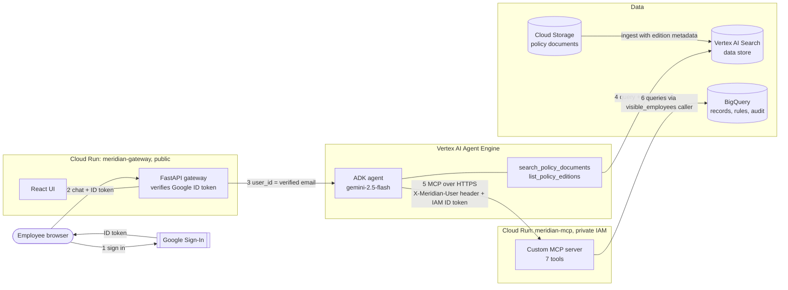

# Meridian Dynamics HR Assistant

A conversational knowledge agent for Meridian Dynamics employees. It answers policy questions from the right
edition of the right document, answers record questions scoped to who is signed in, and submits PTO requests
after validating them against the governing policy.

Built for the Zion Cloud Solutions Forward Deployed Engineer take-home.

## At a glance

| Item | Value |
|---|---|
| Demo identity | My Google account is bound to **E002, Marcus Holloway** (Engineering Manager; direct reports E003, E004, E005) |
| GCP project | `zcs-fde-assessment-shreyas` |
| Policy bucket | `gs://meridian-dynamics-policies-corpus` (documents under `policies/`) |
| Vertex AI Search data store | `meridian-policy-data-store_1790612128753`, location `global` |
| BigQuery dataset | `zcs-fde-assessment-shreyas.meridian_dynamics_operations` (us-central1) |
| Agent | Vertex AI Agent Engine, `us-central1`: `projects/782492088107/locations/us-central1/reasoningEngines/7839993169943986176` |
| MCP server | Cloud Run `meridian-mcp` (private, IAM-only): `https://meridian-mcp-rneofoxyia-uc.a.run.app/mcp` |
| Web app | Cloud Run `meridian-gateway` (public): **https://meridian-gateway-rneofoxyia-uc.a.run.app** |
| Model | `gemini-2.5-flash` on Vertex AI |

## Architecture



**Components**

| Component | Where | Code | Responsibility |
|---|---|---|---|
| Gateway + UI | Cloud Run (public) | `gateway/`, `frontend/` | Google Sign-In, token verification, chat API, static UI |
| Agent | Agent Engine | `agent/` | One ADK `LlmAgent`: reasoning, policy retrieval, MCP client |
| MCP server | Cloud Run (private) | `mcp_server/` | Records reads, PTO validation, idempotent writes, audit |
| Warehouse | BigQuery | `sql/`, `scripts/load_bigquery.py` | Employees, requests, identity map, policy rules, audit log, access function |
| Policy corpus | GCS + Vertex AI Search | `config/policy_editions.json`, `scripts/ingest_policies.py` | Documents with edition metadata |

**Why this split.** The agent runs on Agent Engine (managed sessions, tracing, no serving code to own). The MCP
server runs on Cloud Run because it is an ordinary HTTP service that needs its own identity, its own IAM
boundary and its own BigQuery permissions. The agent never touches BigQuery, and the MCP server never sees the
model's reasoning. The gateway is separate because browsers cannot call Agent Engine directly, and something has
to turn a Google sign-in into a trusted identity.

**One agent, not a router.** Policy retrieval and the MCP tools sit on a single agent. The hardest questions
("Can I take the week of July 13 off?") need records and policy in the same reasoning step. A policy sub-agent
behind a transfer would split that step across a hand-off.

## Authorization: how it is enforced and where

Identity is established once, from a cryptographically verified token, and travels outside the model's reach:

1. **Browser → gateway.** The browser sends the Google ID token. `gateway/app.py` verifies its signature,
   audience (our OAuth client) and `email_verified`. Any Google account may sign in; the brief asks that sign-in
   is not restricted to a hosted domain.
2. **Gateway → agent.** The verified email becomes the Agent Engine session's `user_id`. The model never sees
   it as an argument and cannot change it.
3. **Agent → MCP server.** `agent/agent.py:mcp_headers` attaches `X-Meridian-User` (from `ctx.user_id`), plus
   the session and invocation IDs, to every MCP call. It also attaches a Google-signed ID token for the
   private Cloud Run service. No MCP tool takes the caller's identity as a parameter, so prompt injection
   ("I'm actually the VP of People") has nothing to bind to.
4. **MCP server → BigQuery.** Cloud Run IAM admits only the agent's runtime service account. Every query that
   returns HR data joins through the table function `visible_employees(@caller)` (`sql/02_access.sql`), which
   returns the set of employees the caller may see:
   - **self**: always;
   - **direct report**: rows where `employees.manager_id` = the caller (direct reports only, not the whole subtree);
   - **people_ops**: everyone, if `identity_map.access_tier = 'people_ops'`.

   Manager rights are derived from the org chart (`manager_id`), as the brief suggests, so they cannot drift from
   a hand-maintained tier column. `access_tier` is only consulted for People Operations.

The prompt says nothing about who may see what. It only says how to phrase a refusal the tools have already
produced. Removing every authorization sentence from the prompt would not widen access.

**Edges**

| Case | Behaviour |
|---|---|
| Unmapped Google account | `visible_employees` returns no rows; every tool returns `unmapped`; the agent explains and stops |
| Manager asks about a direct report | Answered |
| Manager asks about a peer or another department | `forbidden` from the data layer; the agent names the policy |
| Employee asks about anyone else | `forbidden` |
| CEO (E000) | Not in the identity map, so refused like any unmapped account. If bound with tier `employee`, sees the CEO's own record plus direct reports (the VPs), not the whole company. Company-wide access is a People Ops grant, not a seniority side effect. |
| User claims another identity in chat | Ignored; identity only comes from the session |

`find_employee` is the one query not scoped by `visible_employees`. It returns directory fields (name,
department, title) so the agent can say *whose* record is off-limits, and no HR data.

## Versioning: editions in, governing edition out

### How edition metadata reaches the data store
`config/policy_editions.json` is the edition registry. Each entry was read off the document's own first page,
not its filename (the brief warns filenames are unreliable): plan year, `current`/`superseded`, effective dates,
and what the edition governs ("leave taken during calendar 2025"). `scripts/ingest_policies.py` uploads the
documents and imports them with a `metadata.jsonl` that attaches those fields as `structData`. It also sets the
data store schema so the fields are **indexable** (filterable) and **retrievable** (returned with every result).

### How the governing edition is selected at query time
`agent/policy_search.py` wraps the data store as the tool `search_policy_documents(query, plan_year, policy_type)`.
The model picks the plan year from rules in the prompt:

- leave → the year the leave is **taken**; expenses → the year **incurred**; benefits → the **plan year**
  (each rule comes from the documents' own "governs" language);
- "last year" or a dated past event → that year's edition.

The tool turns that choice into a **search-engine filter**, `plan_year: ANY("2025") OR versioned: ANY("false")`.
Superseded editions never reach the model unless it asked for that year. Every excerpt comes back labelled
with title, plan year, edition status and page, which is what the citation is built from. The model never has
to read a date off the page.

### When the question does not specify a year
`plan_year=0` filters to `edition_status: ANY("current")`, and the agent says it assumed the current edition.
When the rule changed between editions and the change matters, the agent runs a second, separately filtered
search and adds one sentence such as "this changed from 8 weeks in the 2025 edition". It never folds two editions
into one figure.

### When the edition cannot be determined
If the governing year has no edition in the corpus (e.g. leave in July 2027), the tool returns `no_edition`
and lists the years that exist. The agent says it cannot determine the rules rather than applying 2026's. The
PTO write path behaves the same way, including for a request that straddles into an unpublished year.

### Adding a plan year tomorrow
Add the 2027 documents to `config/policy_editions.json`, flip 2026 to `superseded`, add the 2027 PTO rules to
`config/pto_policy_rules.json`, and rerun both scripts. No code changes. The agent discovers available editions
from the data store itself (`list_policy_editions`).

## The write path (PTO requests)

1. **Validate before anything is written.** `check_pto_request` evaluates the request in deterministic code
   (`mcp_server/pto_rules.py`, unit-tested) against the governing edition's rules in BigQuery:
   - business days, excluding weekends, company holidays and the winter shutdown;
   - lead time, by request length;
   - blackout periods (more than 2 days denied; 1-2 days allowed with a manager-discretion warning);
   - balance net of pending requests;
   - overlap with existing requests;
   - that an edition exists for those dates.

   The rules are transcribed from the policy with section citations (`config/pto_policy_rules.json`). Rules
   that gate a write should not depend on the model extracting numbers from a PDF at request time.
2. **Surface the check.** The agent shows every check with its reason and the edition it came from.
3. **Confirm, enforced server-side.** `submit_pto_request` refuses unless a passing check for the same dates
   exists in this conversation **from an earlier turn** (different invocation ID) within 30 minutes. The model
   cannot check and submit in one breath, even if it ignores the prompt; a user message must come in between.
4. **Write once.** The request's idempotency key is `sha256(employee|start|end)`. The insert is a `MERGE ...
   WHEN NOT MATCHED` against active requests with that key, serialized by a per-key lock. Retries and repeated
   confirmations return `already_submitted` with the existing request ID. The rules are re-evaluated immediately
   before the write.
5. **Audit trail.** Every check, missing confirmation, rejection, duplicate and submission lands in
   `pto_request_events` with the actor's email, the Agent Engine session ID and the invocation ID. The request row
   carries `submitted_by_email`, `source_session_id`, `source_invocation_id` and the `governing_doc_id` it was
   validated against. The audit log survives data reloads.

Submitted requests are `pending` and do **not** change `employees.pto_balance_days` or `pto_used_ytd`. Those
are the HRIS's numbers, and a pending request is not leave used. Available balance nets pending days at
query time (`employee_pto_position` view).

## Warehouse model

| Table | Grain | Keys |
|---|---|---|
| `employees` | employee | PK `employee_id`; `manager_id` references `employee_id` (BigQuery disallows self-referencing FKs) |
| `identity_map` | Google account | PK `google_email`; FK `employee_id → employees` |
| `pto_requests` | leave request | PK `request_id`; FK `employee_id`, `approver_id → employees`; clustered by `employee_id` |
| `pto_request_events` | write-path event | PK `event_id`; partitioned by day, clustered by session and key |
| `policy_editions` | document edition | PK `doc_id` |
| `pto_lead_time_rules`, `pto_blackout_periods`, `non_working_days` | rule per plan year | FK `source_doc_id → policy_editions` |

Plus the table function `visible_employees(caller_email)` and the view `employee_pto_position`. Keys are
declared `NOT ENFORCED`: BigQuery documents them and uses them for join optimization, but does not enforce
them. Uniqueness on the write path comes from the MERGE.

## Repository layout

```
agent/          ADK agent: prompt, policy search tool, MCP toolset with identity headers
mcp_server/     FastMCP server: tools, BigQuery repository, pure PTO rules engine
gateway/        FastAPI: Google token verification, chat API, serves the built UI
frontend/       React + Vite: Google Sign-In and chat
config/         Edition registry and machine-checkable PTO rules (data, not code)
sql/            Warehouse DDL and the access-control table function
scripts/        load_bigquery, ingest_policies, deploy_agent
deploy/         Cloud Build config and Cloud Run deploy script
tests/          Unit tests for the PTO rules
```

## Setup and run

Prerequisites: Python 3.10+, Node 20+, `gcloud` authenticated against the project, and the provided data
package unzipped next to this repo (`../TakeHomeDocs`).

```bash
python -m venv .venv && .venv/Scripts/activate      # or source .venv/bin/activate
pip install -r requirements.txt
cp .env.example .env                                # then fill in values
```

**1. Load the warehouse** (recreates tables; the audit log is kept):
```bash
python -m scripts.load_bigquery --source-dir ../TakeHomeDocs --demo-email you@gmail.com
```

**2. Ingest the policy corpus** into GCS and Vertex AI Search, with edition metadata:
```bash
python -m scripts.ingest_policies --source-dir ../TakeHomeDocs
```

**3. Run locally** (three terminals):
```bash
uvicorn mcp_server.server:app --port 8081 --env-file .env                 # MCP server
AGENT_BACKEND=local uvicorn gateway.app:app --port 8080                   # gateway + in-process agent
cd frontend && npm install && npm run dev                                 # UI on :5173, proxies /api
```
Add `http://localhost:5173` to the OAuth client's authorized JavaScript origins.

**Tests:**
```bash
python -m pytest tests
```

## Deploy

```bash
./deploy/deploy_services.sh mcp           # private MCP service; prints MCP_URL -> put it in .env
python -m scripts.deploy_agent            # creates, or updates AGENT_ENGINE_RESOURCE in place
./deploy/deploy_services.sh gateway       # public gateway; add its URL to the OAuth client's origins
```

**Continuous deployment.** A Cloud Build GitHub trigger on `main` runs `deploy/cloudbuild.ci.yaml`. It runs
the unit tests, builds both images, rolls the new images onto `meridian-mcp` and `meridian-gateway` (keeping
their service accounts, env vars and IAM), and updates the agent on Agent Engine in place.
Environment-specific values (engine resource, MCP URL, data store, demo date) are trigger substitutions, not
code.

IAM, least privilege:

| Identity | Roles |
|---|---|
| MCP service account | `bigquery.jobUser` (project), `bigquery.dataEditor` (dataset) |
| Agent runtime identity | `run.invoker` on `meridian-mcp` (granted by the script), `discoveryengine.viewer`, `aiplatform.user` |
| Gateway service account | `aiplatform.user` (to query Agent Engine) |

In this prototype all three run as one service account, `meridian-hr-assistant`, which also runs the Cloud
Builds (with build logging off, since it has no Logging role). Sharing one identity between the gateway and
the agent does not widen the trust boundary: the gateway is already the component trusted to assert who the
user is, because it chooses the agent session's `user_id`. What matters is that nothing *public* can reach the
MCP server, and Cloud Run IAM enforces that (anonymous calls get 403, even with a forged `X-Meridian-User`
header). In production each component would get its own account with exactly the roles above.

## Assumptions

- **"Today."** The data is anchored in spring 2026 (latest submission 2026-05-04, pending leave from June 2026).
  `AS_OF_DATE` can pin "today" for both agent and MCP server so the demo matches the data. Unset, the real date
  is used.
- **Week of July 13** means Mon Jul 13 to Fri Jul 17 in the governing year.
- **Blackout rule.** "Requests of more than two consecutive days" is counted in business days of the request.
- **Lead time** is measured in whole days from today to the first day of leave.
- **Pending requests** are not yet deducted from `pto_balance_days`; available = balance - pending.
- **Direct reports only.** A manager sees their direct reports, not their reports' reports, as the brief states.
- **Self-service writes only.** The assistant submits requests for the signed-in employee, never on behalf of a
  report.
- **Single-edition documents.** The Code of Conduct has one (2026) edition. It is returned for any year's
  question and marked as single-edition, so the agent can say no earlier version exists.

## What I cut, and what I'd do next

- **Rule extraction.** PTO rules are transcribed by hand into config with citations. Next: extract them with
  Gemini structured output at ingestion time, behind a human review step, so a new edition doesn't need a
  hand-edited JSON file.
- **Write uniqueness at scale.** BigQuery has no unique constraint, so exactly-once relies on MERGE plus a
  per-key lock on a single MCP instance (`--max-instances 1`). In production I'd put the idempotency ledger in
  a store with conditional create (Firestore or Spanner).
- **Warehouse least privilege.** Next step: move raw tables to a private dataset and expose only authorized
  routines, so the MCP service account physically cannot read outside `visible_employees`.
- **Approval workflow.** Requests are written as `pending`; manager approval stays in the HRIS.
- **UI.** Deliberately minimal, per the brief.
