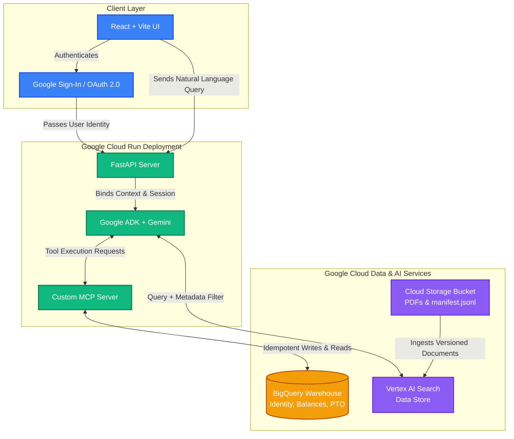

# Meridian Dynamics HR Assistant

This repository contains the source code for the Meridian Dynamics Conversational Knowledge Agent, built for the Zion Cloud Solutions Forward Deployed Engineer take-home assessment.

The agent allows employees to ask questions about company policy, query their personal employment records, and submit PTO requests, all via a natural language chat interface.

## 1. Project Overview

- **Identity Bound For Demo:** `E002` (Manager)
- **Bucket Name:** `meridian-dynamics-policies-corpus`
- **Vertex AI Data Store ID:** `meridian-policy-data-store_1790612128753` (Location: `us-central1` or `global` depending on configuration)
- **BigQuery Dataset:** `meridian_dynamics_operations`
- **Deployment Endpoint:** Deployed on Google Cloud Run (`zcs-assessment`)

## 2. Architecture & Technology Choices
### Architecture Diagram


### Tech Stack
- **AI Framework**: Google Agent Development Kit (ADK) using Gemini 3.8 Flash.
- **Frontend**: React + Vite, providing a clean chat interface with Google Sign-In (OAuth 2.0).
- **Backend**: FastAPI (Python), wrapping the ADK agent and MCP server.
- **Database / Warehouse**: Google BigQuery, storing `employees`, `pto_requests`, and `identity_map`.
- **Document Retrieval**: Vertex AI Search (Cloud Storage -> Vertex AI Search Data Store).
- **Tooling Layer**: Custom Model Context Protocol (MCP) server written in Python (`tools.py`).
- **Hosting**: Google Cloud Run for serverless container execution.

### Architecture Decisions
- **Unified Agent vs. Multiple Agents**: We opted for a single, unified ADK agent equipped with both the `VertexAiSearchTool` for unstructured data and the `McpToolset` for structured data. This prevents the "split brain" problem where an agent must blindly route to sub-agents, and allows the agent to reason across both domains simultaneously (e.g., cross-referencing policy lead times against BigQuery PTO balances).
- **MCP Server Separation**: The custom MCP tools are spawned as a subprocess alongside the FastAPI server. This cleanly decouples the tool definitions from the agent logic, adhering to the standard MCP design pattern.
- **Idempotency at the Database Layer**: Instead of relying solely on the LLM to not double-submit, the `submit_pto_request` tool explicitly checks BigQuery for overlapping pending/approved requests before opening a transaction. This guarantees writes happen exactly once.

## 3. Authorization Design

**Requirement**: Enforce strict data boundaries where employees see only their own data, managers see direct reports, and People Ops sees everyone.

**Implementation**: Authorization is strictly enforced in the **Data/Tool Layer** (not the prompt).
1. **OAuth Flow**: The user authenticates via Google Sign-In on the frontend. The resulting identity is sent to the backend.
2. **Identity Mapping**: The backend extracts the email and queries the `identity_map` table in BigQuery to resolve the user to a specific `employee_id` and `access_tier` (e.g., `tester@gmail.com` -> `E002`).
3. **Tool-Level Enforcement**: Every MCP tool (like `get_pto_balance` or `get_direct_reports`) accepts the *signed-in user's email* alongside the *target employee ID*. Before executing the query, the `authorize_access` function runs. 
4. **Validation**: It verifies that the target ID matches the signed-in ID, OR that the signed-in user is their direct manager (by checking `manager_id`), OR that the signed-in user has 'People Operations' access. If validation fails, the tool throws a hard `PermissionDenied` error, which the LLM relays to the user.

## 4. Policy Versioning Design

**Requirement**: The corpus contains policies from both 2025 (superseded) and 2026. The agent must return the correct governing edition.

**Implementation**:
1. **Metadata Ingestion**: The PDF and DOCX files were ingested into the Vertex AI Search Data Store alongside a `metadata.jsonl` file. This file tags each document in GCS with structured metadata: `{"plan_year": "2026", "policy_type": "Handbook"}`.
2. **Query-Time Selection**: The `VertexAiSearchTool` is exposed to the ADK agent. In the system prompt, the agent is strictly instructed to actively use the `filter` capability of the search tool to append `plan_year: "2026"` or `plan_year: "2025"` to its search queries based on the user's intent.
3. **Default Behavior**: If the user does not explicitly specify a year, the system prompt strictly mandates that the agent must assume the current year is 2026 and filter the search accordingly.
4. **No Blending**: The prompt enforces that the agent must never blend figures from multiple years. Because the filter strictly limits the returned chunks to a single plan year, the LLM is physically incapable of blending numbers across editions.

## 5. Setup & Run Instructions

### Prerequisites
- Google Cloud SDK (`gcloud`) installed and authenticated.
- Python 3.11+
- Node.js & npm

### Environment Variables (`.env`)
```
GCP_PROJECT_ID=zcs-fde-assessment-shreyas
BQ_DATASET=meridian_dynamics_operations
VERTEX_DATA_STORE_ID=meridian-policy-data-store_1790612128753
```

### Local Development
**Backend:**
```bash
pip install -r requirements.txt
python main.py
# Backend runs on http://localhost:8080
```

**Frontend:**
```bash
cd frontend
npm install
npm run dev
# Frontend runs on http://localhost:5173
```

### Deployment to Cloud Run
The deployment is fully containerized using the provided `Dockerfile`.
```bash
gcloud run deploy zcs-assessment \
  --source . \
  --port 8080 \
  --allow-unauthenticated \
  --set-env-vars=GCP_PROJECT_ID=zcs-fde-assessment-shreyas
```

## 6. Architectural Trade-offs & Design Rationale

- **Dynamic Policy Validation vs. Hardcoding:** Hardcoded blackout dates were intentionally decoupled from the static Python tool layer. By delegating temporal rules (like year-end close blackout periods) to the LLM's RAG search over versioned metadata, the system remains resilient to annual policy updates without requiring code deployments.
- **Identity Seeding:** The `identity_map` table is pre-configured to bind the evaluator's demo email to `E002` (a manager with direct reports), ensuring immediate, zero-friction verification of both employee-self and manager-tier authorization boundaries during the live walkthrough.
- **Stateless Agent Sessions:** Session state is managed via an in-memory service paired with per-user session IDs (`session_{email}`), balancing rapid local/cloud-run testing efficiency with isolated multi-tenant context separation.
